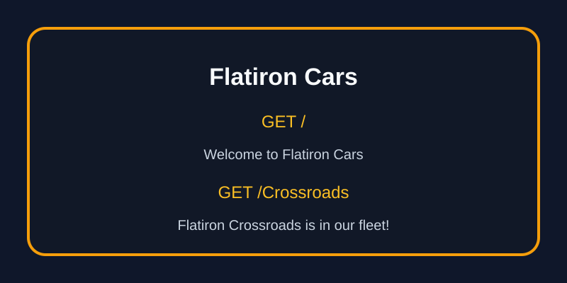

# Flatiron Cars Flask Routes Lab

## Overview

This Flask application serves a simple car catalog experience for Flatiron Cars. It exposes two routes:

- `/` returns a welcome message for the company
- `/<model>` checks whether a requested model is in the current catalog and returns a helpful message

## Features

- Home route that welcomes visitors to Flatiron Cars
- Model lookup route that confirms known models or reports unknown ones
- Clear, commented Flask code for maintainability

## Project Structure

- [server/app.py](server/app.py) contains the Flask app and route handlers
- [server/testing/app_test.py](server/testing/app_test.py) contains the test suite for the routes

## Routes

- `GET /` → returns `Welcome to Flatiron Cars`
- `GET /<model>` → returns either:
  - `Flatiron {model} is in our fleet!` for known models
  - `No models called {model} exists in our catalog` for unknown models

## Local Development

1. Install dependencies with `pipenv install`
2. Start the Flask app from the project root with `python server/app.py` or run the test suite with `pytest`
3. Visit `/` and `/<model>` in your browser or use a test client

## Screenshot

## Notes

The implementation uses a small catalog list and straightforward route logic so the app is easy to extend with more models or richer responses later.
